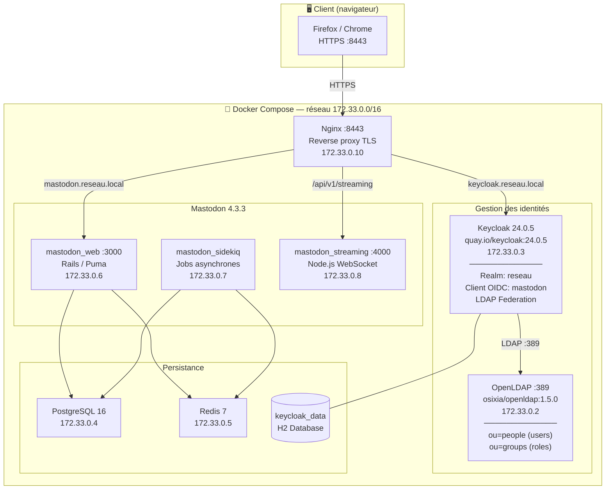
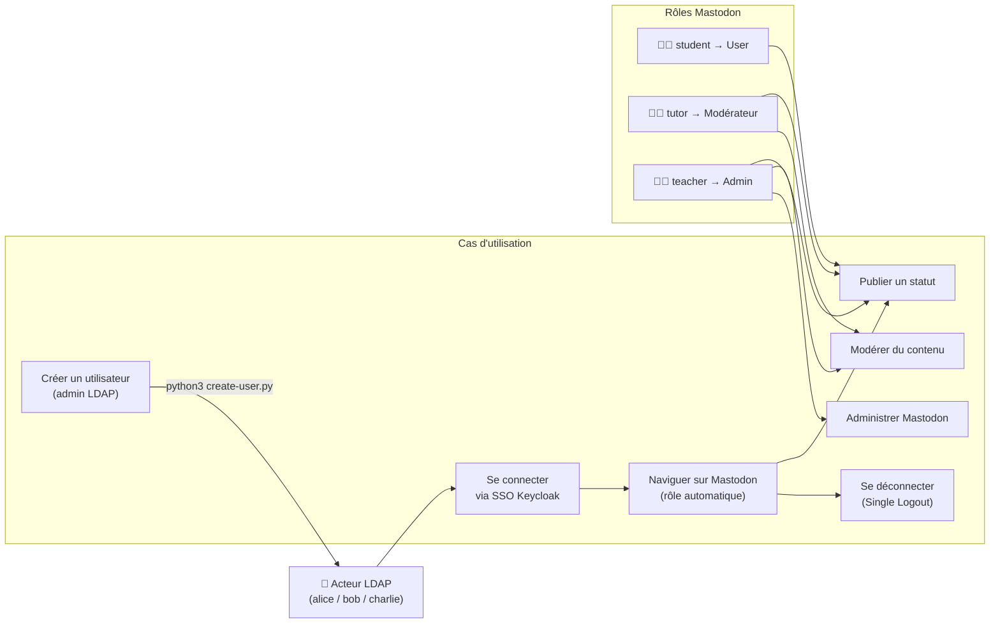
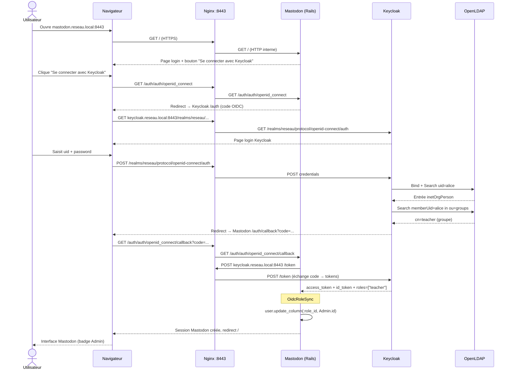
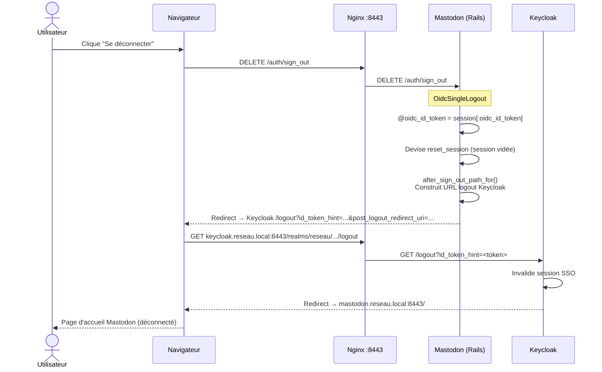
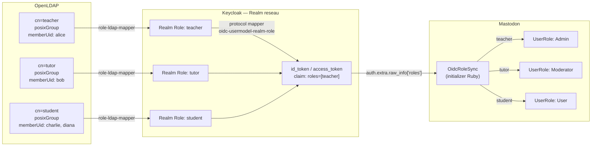
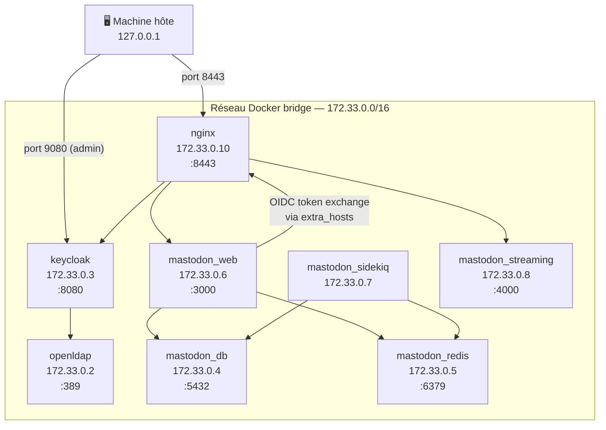
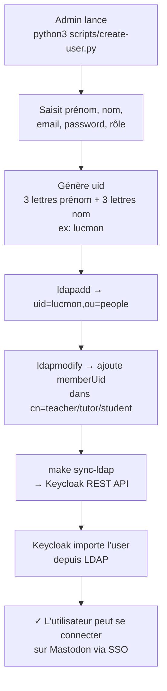

# Diagrammes — Projet Réseau (LDAP + Keycloak + Mastodon)

---

## 1. Stack technologique

---

## 2. Use Case

---

## 3. Séquence — Connexion SSO

---

## 4. Séquence — Déconnexion (Single Logout)

---

## 5. Mapping des rôles LDAP → Keycloak → Mastodon

---

## 6. Architecture réseau Docker

---

## 7. Flux de création d'un utilisateur

