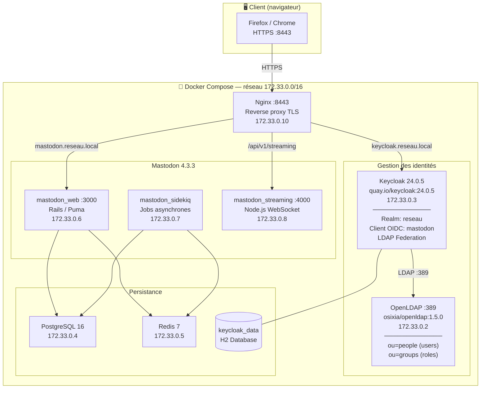

```mermaid
graph TB
    subgraph Client["🖥️ Client (navigateur)"]
        Browser["Firefox / Chrome<br/>HTTPS :8443"]
    end

    subgraph Docker["🐳 Docker Compose — réseau 172.33.0.0/16"]
        Nginx["Nginx :8443<br/>Reverse proxy TLS<br/>172.33.0.10"]

        subgraph IAM["Gestion des identités"]
            LDAP["OpenLDAP :389<br/>osixia/openldap:1.5.0<br/>172.33.0.2<br/>─────────────<br/>ou=people (users)<br/>ou=groups (roles)"]
            KC["Keycloak 24.0.5<br/>quay.io/keycloak:24.0.5<br/>172.33.0.3<br/>─────────────<br/>Realm: reseau<br/>Client OIDC: mastodon<br/>LDAP Federation"]
        end

        subgraph Mastodon["Mastodon 4.3.3"]
            Web["mastodon_web :3000<br/>Rails / Puma<br/>172.33.0.6"]
            Sidekiq["mastodon_sidekiq<br/>Jobs asynchrones<br/>172.33.0.7"]
            Streaming["mastodon_streaming :4000<br/>Node.js WebSocket<br/>172.33.0.8"]
        end

        subgraph Data["Persistance"]
            PG["PostgreSQL 16<br/>172.33.0.4"]
            Redis["Redis 7<br/>172.33.0.5"]
            KCVol[("keycloak_data<br/>H2 Database")]
        end
    end

    Browser -->|"HTTPS"| Nginx
    Nginx -->|"mastodon.reseau.local"| Web
    Nginx -->|"keycloak.reseau.local"| KC
    Nginx -->|"/api/v1/streaming"| Streaming
    KC -->|"LDAP :389"| LDAP
    Web --> PG
    Web --> Redis
    Sidekiq --> PG
    Sidekiq --> Redis
    KC --- KCVol
```
