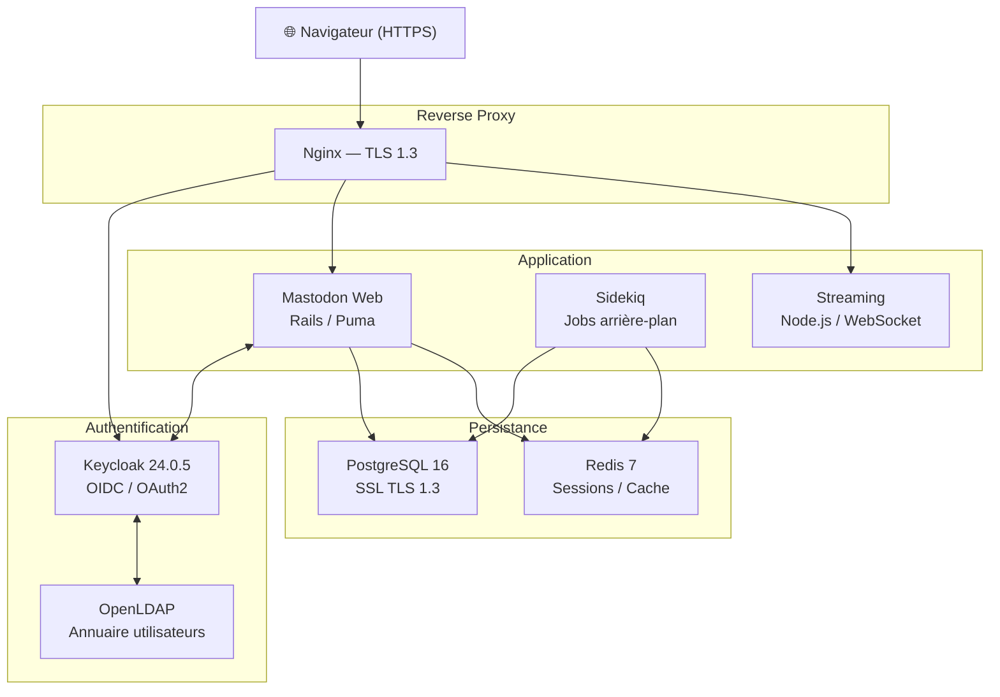

```mermaid
graph TB
    Browser["🌐 Navigateur (HTTPS)"]

    Browser --> Nginx

    subgraph Proxy["Reverse Proxy"]
        Nginx["Nginx — TLS 1.3"]
    end

    subgraph Auth["Authentification"]
        KC["Keycloak 24.0.5<br/>OIDC / OAuth2"]
        LDAP["OpenLDAP<br/>Annuaire utilisateurs"]
        KC <--> LDAP
    end

    subgraph App["Application"]
        Web["Mastodon Web<br/>Rails / Puma"]
        Sidekiq["Sidekiq<br/>Jobs arrière-plan"]
        Streaming["Streaming<br/>Node.js / WebSocket"]
    end

    subgraph Data["Persistance"]
        PG["PostgreSQL 16<br/>SSL TLS 1.3"]
        Redis["Redis 7<br/>Sessions / Cache"]
    end

    Nginx --> KC
    Nginx --> Web
    Nginx --> Streaming
    Web <--> KC
    Web --> PG
    Web --> Redis
    Sidekiq --> PG
    Sidekiq --> Redis
```
