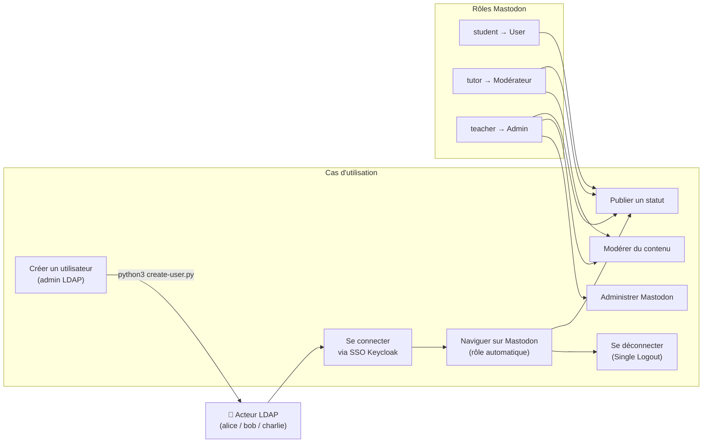

```mermaid
flowchart LR
    A["👤 Acteur LDAP<br/>(alice / bob / charlie)"]

    subgraph UC["Cas d'utilisation"]
        U1["Se connecter<br/>via SSO Keycloak"]
        U2["Naviguer sur Mastodon<br/>(rôle automatique)"]
        U3["Publier un statut"]
        U4["Modérer du contenu"]
        U5["Administrer Mastodon"]
        U6["Se déconnecter<br/>(Single Logout)"]
        U7["Créer un utilisateur<br/>(admin LDAP)"]
    end

    subgraph Roles["Rôles Mastodon"]
        R1["student → User"]
        R2["tutor → Modérateur"]
        R3["teacher → Admin"]
    end

    A --> U1
    U1 --> U2
    U2 --> U3
    U2 --> U6

    R1 --> U3
    R2 --> U3
    R2 --> U4
    R3 --> U3
    R3 --> U4
    R3 --> U5

    U7 -->|"python3 create-user.py"| A
```
