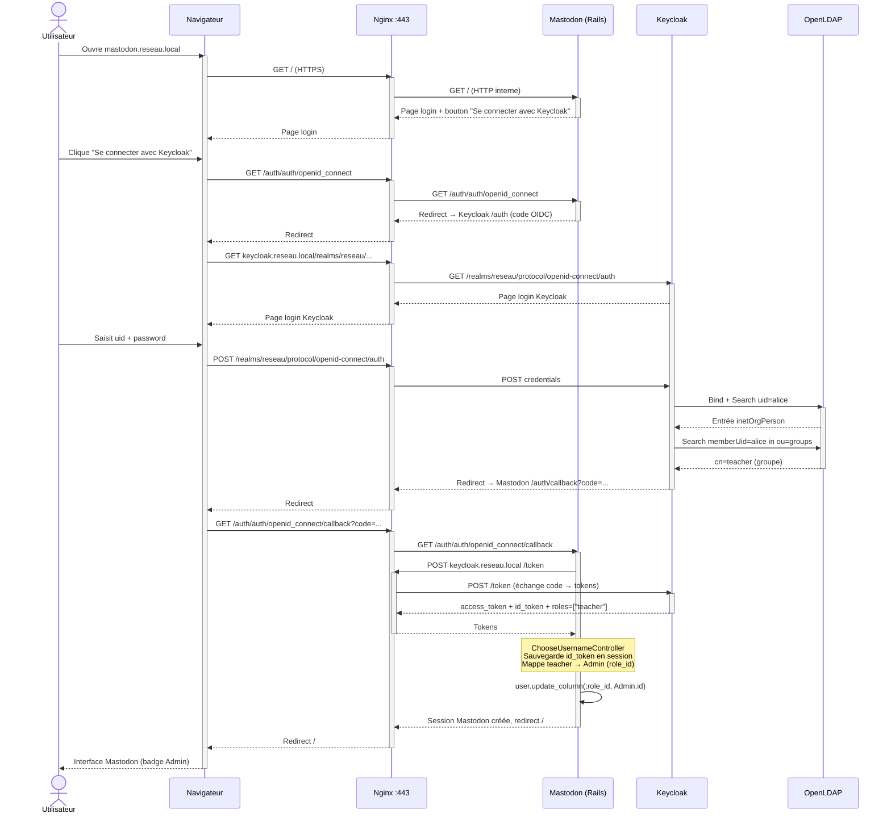

```mermaid
sequenceDiagram
    actor User as Utilisateur
    participant Browser as Navigateur
    participant Nginx as Nginx :443
    participant Mastodon as Mastodon (Rails)
    participant Keycloak as Keycloak
    participant LDAP as OpenLDAP

    User->>Browser: Ouvre mastodon.reseau.local
    activate Browser
    Browser->>Nginx: GET / (HTTPS)
    activate Nginx
    Nginx->>Mastodon: GET / (HTTP interne)
    activate Mastodon
    Mastodon-->>Nginx: Page login + bouton "Se connecter avec Keycloak"
    deactivate Mastodon
    Nginx-->>Browser: Page login
    deactivate Nginx

    User->>Browser: Clique "Se connecter avec Keycloak"
    Browser->>Nginx: GET /auth/auth/openid_connect
    activate Nginx
    Nginx->>Mastodon: GET /auth/auth/openid_connect
    activate Mastodon
    Mastodon-->>Nginx: Redirect → Keycloak /auth (code OIDC)
    deactivate Mastodon
    Nginx-->>Browser: Redirect
    deactivate Nginx

    Browser->>Nginx: GET keycloak.reseau.local/realms/reseau/...
    activate Nginx
    Nginx->>Keycloak: GET /realms/reseau/protocol/openid-connect/auth
    activate Keycloak
    Keycloak-->>Nginx: Page login Keycloak
    Nginx-->>Browser: Page login Keycloak
    deactivate Nginx

    User->>Browser: Saisit uid + password
    Browser->>Nginx: POST /realms/reseau/protocol/openid-connect/auth
    activate Nginx
    Nginx->>Keycloak: POST credentials
    Keycloak->>LDAP: Bind + Search uid=alice
    activate LDAP
    LDAP-->>Keycloak: Entrée inetOrgPerson
    Keycloak->>LDAP: Search memberUid=alice in ou=groups
    LDAP-->>Keycloak: cn=teacher (groupe)
    deactivate LDAP
    Keycloak-->>Nginx: Redirect → Mastodon /auth/callback?code=...
    deactivate Keycloak
    Nginx-->>Browser: Redirect
    deactivate Nginx

    Browser->>Nginx: GET /auth/auth/openid_connect/callback?code=...
    activate Nginx
    Nginx->>Mastodon: GET /auth/auth/openid_connect/callback
    activate Mastodon
    Mastodon->>Nginx: POST keycloak.reseau.local /token
    activate Nginx
    Nginx->>Keycloak: POST /token (échange code → tokens)
    activate Keycloak
    Keycloak-->>Nginx: access_token + id_token + roles=["teacher"]
    deactivate Keycloak
    Nginx-->>Mastodon: Tokens
    deactivate Nginx

    Note over Mastodon: ChooseUsernameController<br/>Sauvegarde id_token en session<br/>Mappe teacher → Admin (role_id)
    Mastodon->>Mastodon: user.update_column(:role_id, Admin.id)
    Mastodon-->>Nginx: Session Mastodon créée, redirect /
    deactivate Mastodon
    Nginx-->>Browser: Redirect /
    deactivate Nginx
    Browser-->>User: Interface Mastodon (badge Admin)
    deactivate Browser
```
