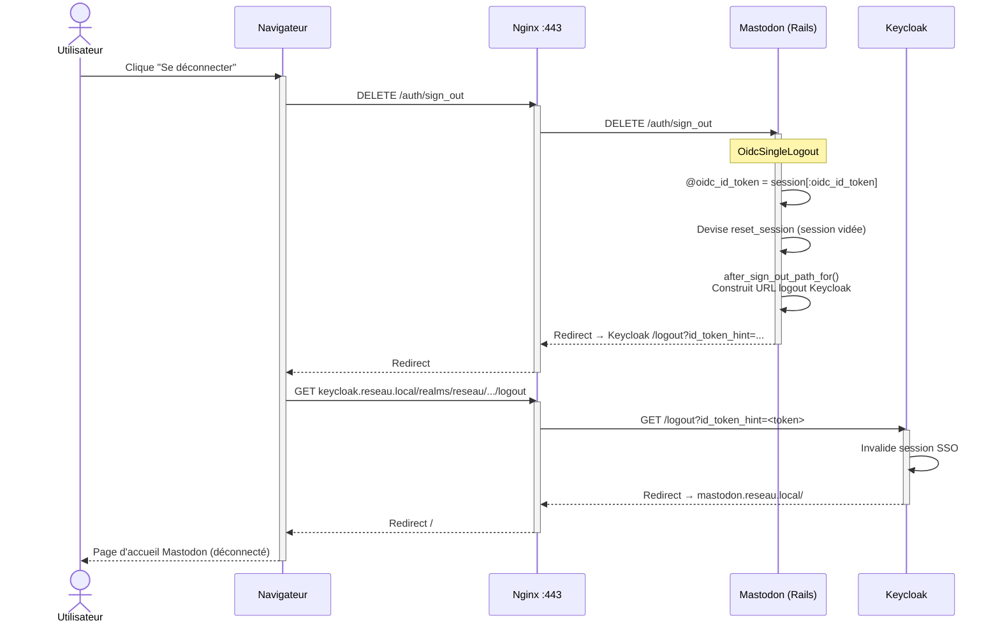

```mermaid
sequenceDiagram
    actor User as Utilisateur
    participant Browser as Navigateur
    participant Nginx as Nginx :443
    participant Mastodon as Mastodon (Rails)
    participant Keycloak as Keycloak

    User->>Browser: Clique "Se déconnecter"
    activate Browser
    Browser->>Nginx: DELETE /auth/sign_out
    activate Nginx
    Nginx->>Mastodon: DELETE /auth/sign_out
    activate Mastodon

    Note over Mastodon: OidcSingleLogout#destroy<br/>Récupère id_token depuis session<br/>AVANT reset_session

    Mastodon->>Mastodon: @oidc_id_token = session[:oidc_id_token]
    Mastodon->>Mastodon: Devise reset_session (session vidée)
    Mastodon->>Mastodon: after_sign_out_path_for()<br/>Construit URL logout Keycloak
    Mastodon-->>Nginx: Redirect → Keycloak /logout?id_token_hint=...
    deactivate Mastodon
    Nginx-->>Browser: Redirect
    deactivate Nginx

    Browser->>Nginx: GET keycloak.reseau.local/realms/reseau/.../logout
    activate Nginx
    Nginx->>Keycloak: GET /logout?id_token_hint=<token>
    activate Keycloak
    Keycloak->>Keycloak: Invalide session SSO
    Keycloak-->>Nginx: Redirect → mastodon.reseau.local/
    deactivate Keycloak
    Nginx-->>Browser: Redirect /
    deactivate Nginx
    Browser-->>User: Page d'accueil Mastodon (déconnecté)
    deactivate Browser
```
