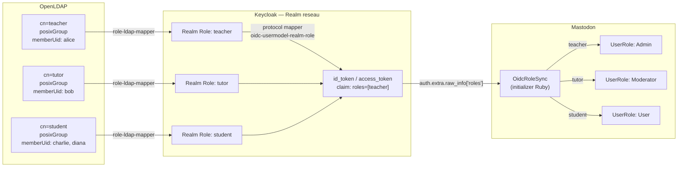

```mermaid
flowchart LR
    subgraph LDAP["OpenLDAP"]
        G1["cn=teacher<br/>posixGroup<br/>memberUid: alice"]
        G2["cn=tutor<br/>posixGroup<br/>memberUid: bob"]
        G3["cn=student<br/>posixGroup<br/>memberUid: charlie, diana"]
    end

    subgraph KC["Keycloak — Realm reseau"]
        R1["Realm Role: teacher"]
        R2["Realm Role: tutor"]
        R3["Realm Role: student"]
        TK["id_token / access_token<br/>claim: roles=[teacher]"]
    end

    subgraph Mastodon["Mastodon"]
        M1["UserRole: Admin"]
        M2["UserRole: Moderator"]
        M3["UserRole: User"]
        CB["OidcRoleSync<br/>(initializer Ruby)"]
    end

    G1 -->|"role-ldap-mapper"| R1
    G2 -->|"role-ldap-mapper"| R2
    G3 -->|"role-ldap-mapper"| R3

    R1 -->|"protocol mapper<br/>oidc-usermodel-realm-role"| TK
    R2 --> TK
    R3 --> TK

    TK -->|"auth.extra.raw_info['roles']"| CB
    CB -->|"teacher"| M1
    CB -->|"tutor"| M2
    CB -->|"student"| M3
```
