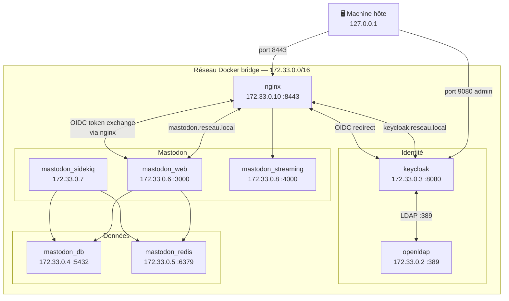

```mermaid
graph TB
    Host["🖥️ Machine hôte<br/>127.0.0.1"]

    subgraph Net["Réseau Docker bridge — 172.33.0.0/16"]
        N["nginx<br/>172.33.0.10 :8443"]

        subgraph IAM["Identité"]
            KC["keycloak<br/>172.33.0.3 :8080"]
            LDAP["openldap<br/>172.33.0.2 :389"]
        end

        subgraph App["Mastodon"]
            WEB["mastodon_web<br/>172.33.0.6 :3000"]
            SID["mastodon_sidekiq<br/>172.33.0.7"]
            STR["mastodon_streaming<br/>172.33.0.8 :4000"]
        end

        subgraph Data["Données"]
            DB["mastodon_db<br/>172.33.0.4 :5432"]
            RED["mastodon_redis<br/>172.33.0.5 :6379"]
        end
    end

    Host -->|"port 8443"| N
    Host -->|"port 9080 admin"| KC

    N <-->|"mastodon.reseau.local"| WEB
    N <-->|"keycloak.reseau.local"| KC
    N --> STR

    KC <-->|"LDAP :389"| LDAP
    KC <-->|"OIDC redirect"| N

    WEB <-->|"OIDC token exchange<br/>via nginx"| N

    WEB --> DB
    WEB --> RED
    SID --> DB
    SID --> RED
```
