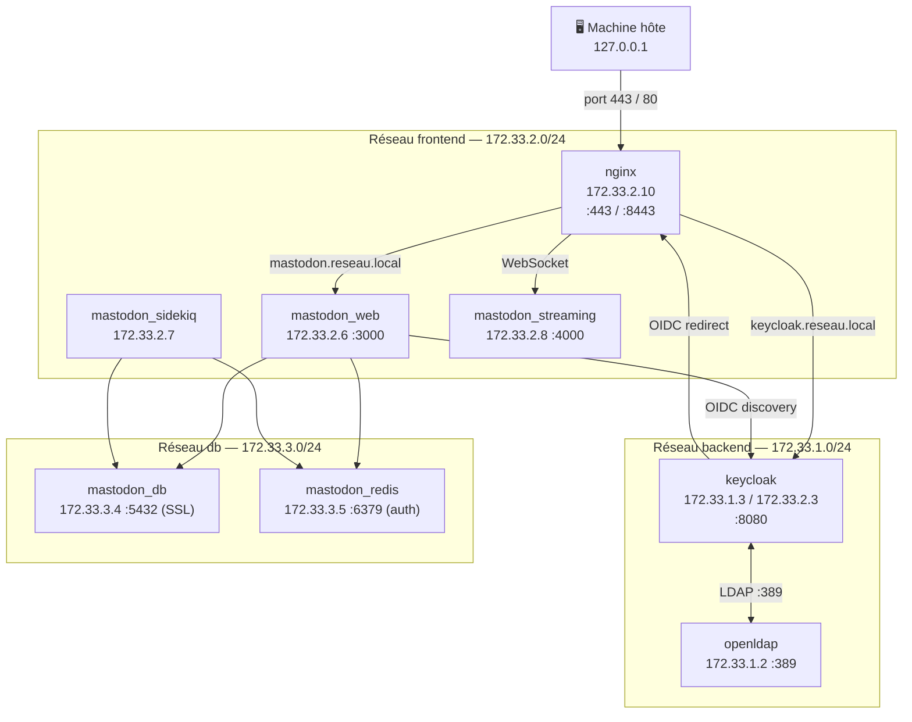

```mermaid
graph TB
    Host["🖥️ Machine hôte<br/>127.0.0.1"]

    Host -->|"port 443 / 80"| N

    subgraph Backend["Réseau backend — 172.33.1.0/24"]
        KC["keycloak<br/>172.33.1.3 / 172.33.2.3<br/>:8080"]
        LDAP["openldap<br/>172.33.1.2 :389"]
        KC <-->|"LDAP :389"| LDAP
    end

    subgraph Frontend["Réseau frontend — 172.33.2.0/24"]
        N["nginx<br/>172.33.2.10<br/>:443 / :8443"]
        WEB["mastodon_web<br/>172.33.2.6 :3000"]
        SID["mastodon_sidekiq<br/>172.33.2.7"]
        STR["mastodon_streaming<br/>172.33.2.8 :4000"]
    end

    subgraph DB["Réseau db — 172.33.3.0/24"]
        PG["mastodon_db<br/>172.33.3.4 :5432 (SSL)"]
        RED["mastodon_redis<br/>172.33.3.5 :6379 (auth)"]
    end

    N -->|"mastodon.reseau.local"| WEB
    N -->|"keycloak.reseau.local"| KC
    N -->|"WebSocket"| STR

    WEB -->|"OIDC discovery"| KC
    KC -->|"OIDC redirect"| N

    WEB --> PG
    WEB --> RED
    SID --> PG
    SID --> RED
```
