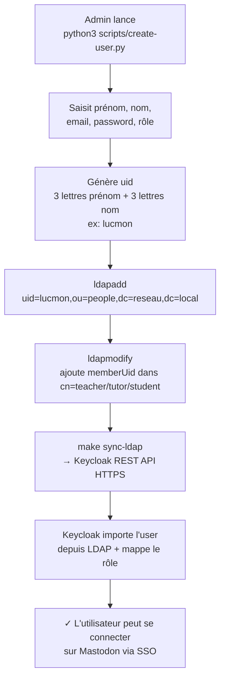

```mermaid
flowchart TD
    A["Admin lance<br/>python3 scripts/create-user.py"]
    B["Saisit prénom, nom,<br/>email, password, rôle"]
    C["Génère uid<br/>3 lettres prénom + 3 lettres nom<br/>ex: lucmon"]
    D["ldapadd<br/>uid=lucmon,ou=people,dc=reseau,dc=local"]
    E["ldapmodify<br/>ajoute memberUid dans cn=teacher/tutor/student"]
    F["make sync-ldap<br/>→ Keycloak REST API HTTPS"]
    G["Keycloak importe l'user<br/>depuis LDAP + mappe le rôle"]
    H["✓ L'utilisateur peut se connecter<br/>sur Mastodon via SSO"]

    A --> B --> C --> D --> E --> F --> G --> H
```
